<p align="center"></p>
<h1 align="center"> LoRaWAN </h1> 
<h4 align="right">Aug 24</h4>


<br>

# The Things Stack Cloud (Chile setting)
https://www.thethingsindustries.com/

1. Get a Unique gateway ID ```Gateway EUI```
2. Create an account in TTN 
3. Sign up a user account in TTN server
4. Choose the Cluster: ```nam1``` North America 1	California, USA
5. Get the Network name / Network ID
6. Get the server address ```xxxxxxxxx.nam1.cloud.thethings.industries```
7. Add a gateway in TTN V3 Server using the ```Gateway EUI``` / Gateway server address must match the gateway configuration (la dirección del gateway debe ser igual tanto en el server TTN como el mismo gateway. esta dirección involcra el cluster)
8. Choose frecuency plan ```Australia 915-928 MHz,FSB 2 (used by TTN)```
9. After creating the gateway, you can see the gateway info


## Setting TTN server
https://xxxxxxxxxx.nam1.cloud.thethings.industries/console/

## Screenshot

<p align="center"></p>
<p align="center">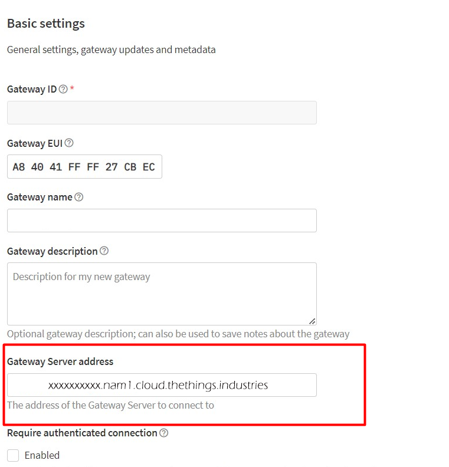</p>
<p align="center">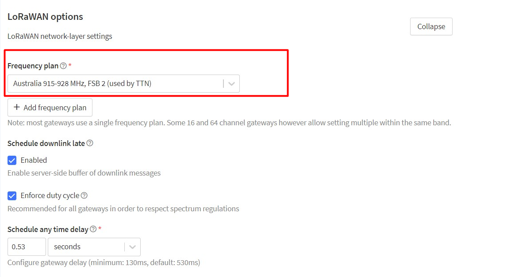</p>

<br>

# DRAGINO DLOS8N Outdoor LoRaWAN Gateway Setting
<p align="center">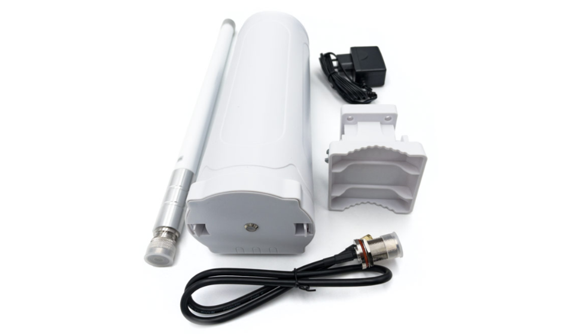</p>

info: http://wiki.dragino.com/xwiki/bin/view/Main/User%20Manual%20for%20All%20Gateway%20models/DLOS8N/

## Typical Network Setup
```Wifi AP:```<br>
name: dragino-27cbec <br>
password: dragino+dragino

```Browser IP``` <br> 
10.130.1.1

```Router Access```<br>
Nombre de usuario: root <br>
Contraseña: dragino

## Ethernet conection

```Eth0 PC setting``` <br>
IP: 172.31.255.253 <br>
Netmask: 255.255.255.252

```Browser IP``` <br>
172.31.255.254:8000

```Router Access```<br>
Nombre de usuario: root <br>
Contraseña: dragino

info: http://wiki.dragino.com/xwiki/bin/view/Main/User%20Manual%20for%20All%20Gateway%20models/DLOS8N/#H11.3IconfiguredDLOS8NforWiFiaccessandlostitsIP.Whattodonow3F

## DLOS8N Setting 
frecuencia: 915/920/923/ EC25-aux

## Access the Internet as a WiFi Client
```path: Network/Wifi/WiFi WAN Client Settings``` <br>
Habilitar (Enable WiFi WAN Client) <br>
Usar (WiFi Survey) para elegir Red WiFi <br>
Usar (Passphrase) para colocar password red

<p align="center">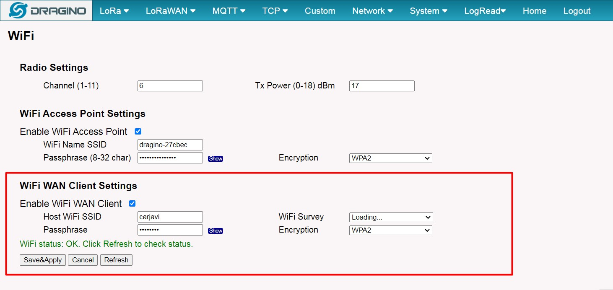</p>
<br>

## 4G setting
????????????????????????????

## Frequency LoRa Chile

```path: LoRa/Radio Settings``` <br>
keep Alive Period (sec): 120 <br>
Frequency Plan: AU915 Australia 915Mhz (915-928) <br>
Frecuency Sub Band: 2:AU915,FSB2 (916.8-918.2)

<p align="center">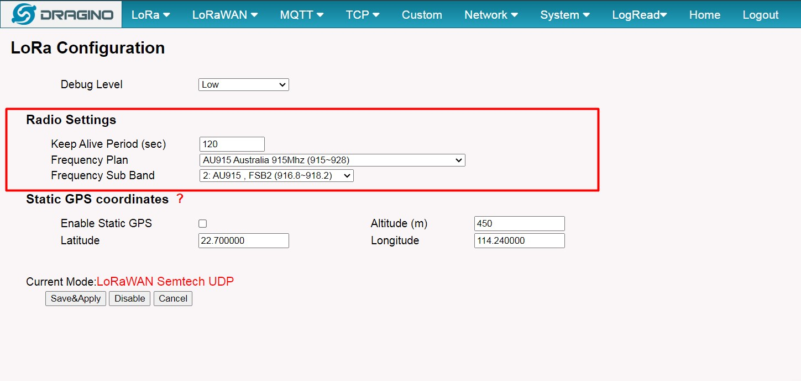</p>
<br>

## Configure DLOS8N to connect to TTN v3

```path: LoRaWan/LoRaWAN-Semtech UDP/LoRaWAN Configuration/Primary LoRaWAN Server``` <br>
Service Provider: Custom / Private LoRaWAN <br>
Server Address: xxxxxxxxx.nam1.cloud.thethings.industries (este dato se obtiene después de crear el server en el TTN)<br>
Uplink : 1700 <br>
Downlink: 1700

<p align="center">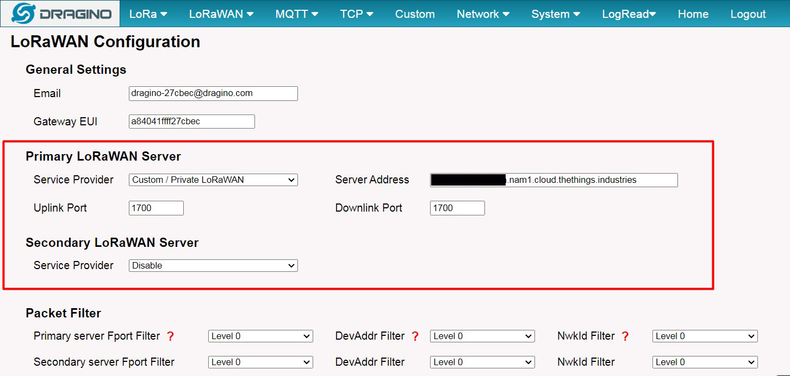</p>
<br>

Note: The server address must match the Gateway server address you choose in TTN V3.

## if all is ok!

<p align="center">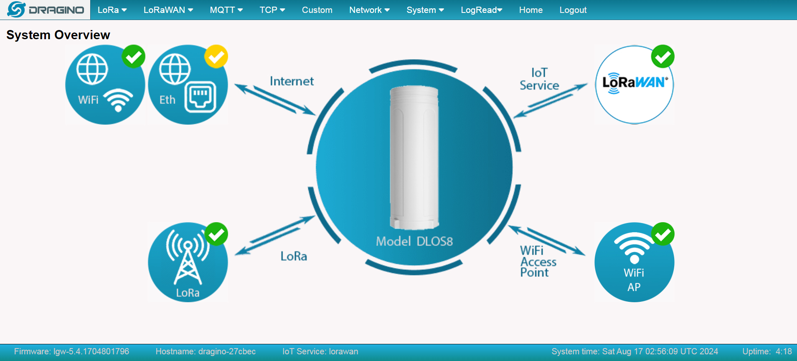</p>

In TTN v3 portal, we can also see the gateway is connected.

## LED Indicators
* SOLID GREEN: DLOS8N is alive with LoRaWAN server connection.

* BLINKING GREEN:Device has internet connection but no LoRaWAN Connection  or Device is in booting stage, in this stage, it will BLINKING GREEN for several seconds and then RED and YELLOW will blink together.

* SOLID RED: Device doesn't have Internet connection.

<br>

# Add a LoRaWAN End Device to The Things Stack Cloud (TTN)
define the device in TTN v3:
DEV EUI - Unique ID code for a particular device. <br>
APP EUI - ID code for an Application defined in TTN v3.<br>
APP Key - Unique key to secure communications with a particular device.<br>

1. Create application in TTN
2. Add end device
3. Register end device with DEV EUI APP / EUI / APP Key
4. Secondly, choose the corresponding frequency and LoRaWAN ```AU_915_928_FSB_2```

info: http://wiki.dragino.com/xwiki/bin/view/Main/User%20Manual%20for%20All%20Gateway%20models/DLOS8N/


# DRAGINO RS485-LB/LS
Waterproof RS485/UART to LoRaWAN Converter

<p align="center">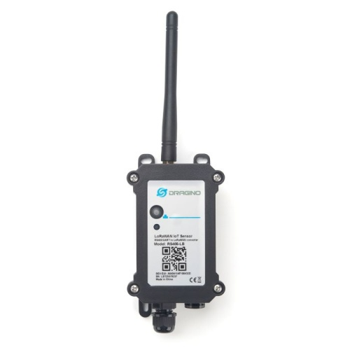</p>

info: http://wiki.dragino.com/xwiki/bin/view/Main/User%20Manual%20for%20LoRaWAN%20End%20Nodes/RS485-LB_Waterproof_RS485UART_to_LoRaWAN_Converter/

> :memo: **Note:** La configuración interna del equipo es mediante puerto serial y 
```comandos AT```, la comunicación con los sensores es mediante UART/RS485 por el protocolo ```MODBUS```

## Button's RS485-LB
```Pressed 1s < time < 3s:``` Send an uplink (If sensor is already Joined to LoRaWAN network, sensor will send an uplink packet, blue led will blink once.)

```Pressing for more than 3s:``` Active Device (JOIN LoRaWAN network)

```Fast press 5 times:``` Deactivate Device (Red led will solid on for 5 seconds. Means device is in Deep Sleep Mode)

## Configure Device to Read RS485/UART Sensors
Después que el END POINT esta configurado en el TTN el equipo se configura con comandos ```AT``` usando un ```FTDI``` y mediante el Software ```DRAGINO-RS485-Config V1.3```<br>

> :warning: **Warning:** es necesario el ```AT PIN: xxxxxx``` que viene en la etiqueta de la caja.

<p align="center">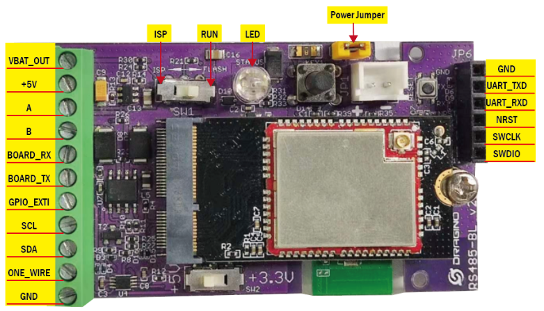</p>

#### Conection FTDI
Desde el conector ```JP6``` conectamos el FTDI: ```RS485LB(Tx)-FTDI(RX)``` / ```RS485LB(Rx)-FTDI(Tx)``` <br>
```SW1:``` flash <br>
```SW2:``` 5V

<p align="center">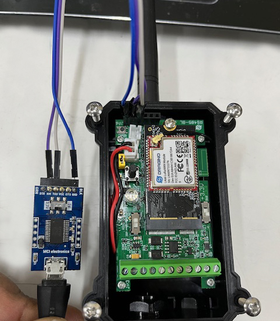</p>

### Configuring the 485-LB from the PC
Software ```DRAGINO-RS485-Config V1.3```<br>
```Port:``` COMXX (depende como el PC detecte el FTDI)<br>
```Node Baudrate:``` 9600 <br>
```5vT (Unit:ms):``` 2000 (tiempo de nivel logico "1" para alimentar el sensor PIN +5V) <br>
```NB-Password:``` XXXXX (es el ```AT PIN: xxxxxx```)


<p align="center">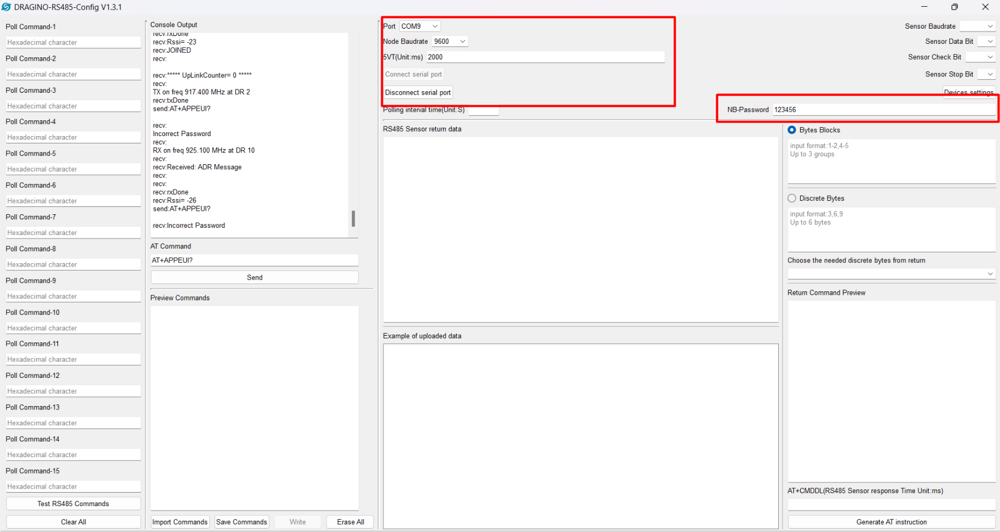</p>


### AT command summary (para la configuración interna del 485LB)
| Name      | Purpose                                         |
|-----------|-------------------------------------------------|
| `AT+BAUDR=9600` | Serial setting                    |
| `AT+PARITY=0` | " |
| `AT+STOPBIT=1` | "     |
| `AT+DATABIT=8` | " |
| `AT+DEUI=?`   | Get or Set the Device EUI|
| `AT+JOIN?` | Get inf Join network  |
| `AT+VER=?`| Show Image version and Frequency Band |
| `AT+PWORD=?` | get password                    |
| `AT+CFG` | Print all configurations |
| `AT+MOD=?`   | 1 or 2 define si el sensor es UART o RS485|
| `AT+MOD=1` | input RS485 sensor |
| `AT+MOD=2` | input UART sensor |
| `AT+5VT=?` | Get times Output +5V                    |
| `AT+TDC=?` | Show current transmit Interval 300000 = 30s, 60000 = 60s|
| `ATZ`   | Reset |
| `AT+FDR` | Reset to factory default  |
| `AT+CLASS=?`| Get the Device Class |
| `AT+CLASS=C` |   Assign Device Class            |
| `AT+PORT=?` | Get the application port |
| `AT+PORT=21`   | Assign application port, define en qué puerto de la aplicación LoRaWAN se enviarán los datos  |
| `AT+GETSENSORVALUE=0` | The serial port gets the reading of the current sensor  |
| `AT+GETSENSORVALUE=1`| The serial port gets the current sensor reading and uploads it |
| `AT+DATAUP=0` | Configura para enviar la data en un solo payload al server                   |
| `AT+DATAUP=1` | Enviar multiples subidas al server |
| `AT+CMDDL1=1000`   | Tiempo de espéra que va a esperar el RS485LB para recibir un dato |
| `AT+MBFUN=1` | Habilito lectura rapida de comandos MODBUS  |
| `AT+PAYVER=1`| Etiqueta para identificar que es el payload 1 |


> :memo: **Note:**
* AT+(comando)?  => pregunta por el estatus del comando o ayuda del comando
* AT+(comando)=? => Pregunta por el valor que tiene asignado el comando
* By default, the AT+5VT=0
  
<br>

# Configure read commands for each sampling from 485LB (MODBUS protocol)
 ```AT+COMMANDx:```  Configure RS485 read command to sensor.<br>
 ```AT+DATACUTx:```  Configure how to handle return from RS485 devices. This command defines how to handle the return from AT+COMMANDx, max reture length is 40 bytes.PAYLOAD is available after the valid value is intercepted.<br>
 ```AT+SEARCHx:```   Configure search command. <br>
 ```AT+CFGDEV:```  send Modbus commands to the serial device to configure it. 
 
 <br>


## AT+COMMANDx:
Con este comando le decimos al 485-LB  como va a leer los datos en el momento que pedimos leer el sensor, bajo el protocolo ModBus

### ModBus Resquest

```
01 03 0B B8 00 02 46 0A
```
en Modbus:<br>
01 --- Address Field (direccion del esclavo)<br>
03 ---  Function Register (Leer registros de tenencia)<br>
0B ---- Starting Address Hi<br>
B8 ---- Starting Address Lo <br>
00 ---- Quantity of Coils Hi (cantidad de registro que va a leer)<br>
02 ---- Quantity of Coils Lo<br>

```este ultimo byte es el CRC-16/Modbus se calcula manualmente```<br>
46 --- Error Check Lo<br>
OA --- Error Check Hi<br>

```0B B8 ``` registro va a iniciar la lectura de los datos <br>
```00 02``` Cantidad de bytes que tiene la data 2 byte<br>


### Funtion Register
01 (0x01) Read Coils<br>
02 (0x02) Read Discrete Inputs<br>
03 (0x03) Read Holding Registers<br>
04 (0x04) Read Input Registers<br>
05 (0x05) Write Single Coil<br>
06 (0x06) Write Single Register<br>
08 (0x08) Diagnostics (Serial Line only)<br>
11 (0x0B) Get Comm Event Counter (Serial Line only)<br>
15 (0x0F) Write Multiple Coils<br>
16 (0x10) Write Multiple Registers<br>
17 (0x11) Report Server ID (Serial Line only)<br>
22 (0x16) Mask Write Register<br>
23 (0x17) Read/Write Multiple Registers<br>
43 / 14 (0x2B / 0x0E) Read Device Identification<br>


AT+COMMANDx command example. 
```
AT+COMMANDx=01 03 0B B8 00 02,m 
```
> :bulb: **Tip:**
> * x => distintos comandos para leer cada sensor. x=1 es para el sensor 1, x = 2 es para el sensor 2. max 15, max 14Bytes por comandos
> * m=0 => no CRC 
> * m=1 => suma un CRC-16/Mobus al final de este comando (no se calcula)
 
ejemplos:
```
AT+COMMAND1= 01 03 00 03 00 08,1 // read slave address 01 , function code 03, start address 0x03, quantity of registers 00 08 --> 8 bytes
AT+DATACUT1=0,0,0 // obtiene toda la data sin cortarla
RETURN1 = 01 03 10  + 8byte de registro + 86 fe
```
```
AT+COMMAND2= 01 03 00 40 00 10,1 --> read slave address 01 , function code 03, start address 0x04, quantity of inputs 00 10 --> 10 bytes
AT+DATACUT2=0,0,0 // obtiene toda la data sin cortarla
RETURN2 = 01 03 10  + 8byte de registro + 86 fe
```

### RETURNx
return modbus:
```
01 03 04 00 06 00 05 DA 31
```
01 ---> direccion del esclavo <br>
03 ---> funcion <br>
04 ---> Byte Count ?<br>
00 ---> Data Hi<br>
06 ---> Data Lo<br>
00 ---> Data Hi<br>
05 ---> Data Lo<br>
DA ---> Error Check Lo<br>
31 ---> Error Check Hi<br>

ejemplo:
```
RETURN1：01 03 02 08 FD 7E 05
```
```The first byte:``` slave address <br>
```The second byte:``` Return to read function code<br>
```3rd byte:``` total number of bytes<br>
```4th～5th bytes:``` register data<br>
```6th and 7th bytes:``` CRC16 checksum<br>

```08 FD``` is register data. 08FD hex => 2301 decimal.

<br>

## AT+DATACUTx
Parsea la respuesta RETURN para sacar solo la data que nos interesa para el payload. Cuando el valor de retorno del sensor tiene una longitud fija y sabemos en qué posición debemos obtener el valor válido, podemos usar el comando AT+DATACUT.
```
AT+DATACUTx=a,b,c
```
> :bulb: **Tip:**
> * a --> longitud del retorno de AT+COMMAND
> * b = 1 ---> tomar valor válido por byte, máximo 6 bytes.
> * b = 2 ---> tome un valor válido por sección de bytes, máximo 3 secciones.
> * c --> definir la posición para el valor válido

ejemplos:
```
AT+DATACUT1=10,1,9+4+6+8+1+3
byte de respuesta 20 20 20 20 2d 30 2e 32 20 75 (10 byte)
a = 10
b = 1
c = 9(noveno byte)+4(cuarto byte)+6(sexto byte)+8(octavo byte)+1(primer byte)+3(tercer byte)
la data es: 20 20 30 32 20 20
el paylod es :0c fc 01 y la data 20 20 30 32 20 20
```
```
AT+DATACUT1=8,2,4~8
RETURN1 = 20 20 20 20 2d 30 2e 00
a = 8 (byte)
b = 2 (toma un rango o intervalos de datos)
c = 4~8 (del cuartobyte hasta el octavo byte) la data es: 20 2d 30 2e 00
payload: 0c fc 01 y la data 20 2d 30 2e 00
```
```
AT+DATACUT1=13,2,1~2+4~7+10~11
RETURN1 = 90 02 6a 82 1a 04 20 2d 30 2e dd 9b 00
a = 13 Byte
b = 2 (toma un rango o intervalos de datos)
c = 1~2+4~7+10~11 (intervalos)
data es : 90 02 82 1a 04 20 2e dd
payload: 0c fc 01 90 02 82 1a 04 20 2e dd
```
```
address: 0x03  // saca la data de este registro
AT+COMMAND1= 01 03 00 03 00 01,1
RETURN1: 01 03 02 00 02 39 85 00 00
AT+DATACUT1: 9,1,4+5+6+7 // Take the return value 00 02 39 85 as the valid value of reading current data and used to splice payload.
```
```
address: 0x0031 
AT+COMMAND3= 01 03 00 31 00 02,1
RETURN3: 01 03 04 00 00 00 44 FA 00
AT+DATACUT3: 9,1,4+5+6+7 Take the return value 00 00 00 44 as the valid value of reading total active energy data and used to splice payload
```
```
AT+DATACUT1=0,0,0 // no corta la data
```
<br>

## AT+SEARCHx
Cuando el valor de retorno del sensor tiene una longitud dinámica y no estamos seguros de qué bytes son los datos válidos, sabemos qué valor sigue el valor válido. Podemos usar AT+SEARCH para buscar el valor válido en la cadena de retorno.
```
AT+SEARCHx=a,xx xx xx xx xx
```
> :bulb: **Tip:**
> * a = 1 --- prefix match mode (lo que comience  con)
> * a = 2 --- prefix and suffix match mode (comience o termine con)
> * xx xx xx xx xx: match string 

ejemplo:
```
la respuesta del comando AT+COMMAND1 es:
16 0c 1e 56 34 2e 30 58 5f 36 41 30 31 00 49
AT+SEARCH1=1,1E 56 34.  //(max 5 bytes for prefix)
la data que se tomara sera lo que venga despues de  1E 56 34, 
esta 2e 30 58 5f 36 41 30 31 00 49
el paylod sera: 8d 2f 01 y la data 2e 30 58 5f 36 41 30 31 00 49
```
```
respuesta : 16 0c 1e 56 34 2e 30 58 5f 36 41 30 31 00 49
AT+SEARCH1=2, 1E 56 34+31 00 49
busca lo que esta entre: 1E 56 3 y 31 00 49, la data es: 2e 30 58 5f 36 41 30
el paylod sera: 8d 2f 01 y la data:2e 30 58 5f 36 41 30
```
```
AT+SEARCH1=0,0  // es igual AT+DATACUT1=0,0,0 // no corta la data
```

> :bulb: **Tip:** ```AT+SEARCHx``` y ```AT+DATACUTx``` se pueden usar juntos; si ambos comandos están configurados, RS485-LB/LS primero procesará AT+SEARCHx en la cadena de retorno y obtendrá una cadena temporal, y luego procesará AT+DATACUTx en esta cadena temporal para obtener la carga útil final. En este caso, AT+DATACUTx debe configurarse en el formato AT+DATACUTx=0,xx,xx donde los bytes de retorno se establecen en 0.

<br>

## AT+CMDDL
Algunos dispositivos RS485 pueden tener un retraso mayor en la respuesta, por lo que el usuario puede usar AT+CMDDL para configurar el tiempo de espera para recibir respuesta después de enviar el comando RS485. Por ejemplo: 
```
AT+CMDDL1=1000 // para enviar el tiempo de apertura a 1000ms
```
<br>

## AT+GETSENSORVALUE
Lectura de los sensores ya configurados con:  ```AT+COMMANDx```, ```AT+DATACUTx```, ```AT+SEARCHx``` y  ```AT+CFGDEV```
```
AT+GETSENSORVALUE=0 // leo la data sin enviar al server
AT+GETSENSORVALUE=1  // leo la data y la sube al server
```

<br>

## Componer la carga útil PAYLOAD
cuando se manda a leer los sensores cada AT+COMMANDx and AT+DATACUTx saca la data de cada sensor y aqui veremos como empaquetar la data de cada sensor

### Envia todos los datas recibidas en un solo formato al server
```
AT+DATAUP=0 // Envia todos los datas recibidas en un solo formato al server
AT+PAYVER=1 // El usuario puede configurar el campo PAYVER para indicarle al servidor cómo decodificar la carga útil actual. el valor es asignado por el usuario. si el PAYVER=1 decodificalo de una forma, si es PAYVER=2 decodificalo de otra forma
```

el formato del Payload es:
```
Battery Info + PAYVER + VALID Value from RETURN1 + Valid Value from RETURN2 + … + RETURNx
```
ejemplo:
```
paylod = 0c fc 01 + data del RETURN1 + data del RETURN2...
```

```0c fc``` ---> bateria voltaje (2 byte)<br>
```01```    --->PAYVER (1 byte)<br>

### Enviar multiples subidas al server
```
AT+DATAUP=1 // Enviar multiples subidas al server
AT+PAYVER=1 // El usuario puede configurar el campo PAYVER para indicarle al servidor cómo decodificar la carga útil actual. el valor es asignado por el usuario. si el PAYVER=1 deco
```
el formato del Payload es:
```
Battery Info + PAYVER + PAYLOAD COUNT + PAYLOAD# + DATA
```
1. Battery Info (2 bytes): Battery voltage
2. PAYVER (1 byte): Defined by AT+PAYVER
3. PAYLOAD COUNT (1 byte): Total de uplink(subidas al server) va hacer 
4. PAYLOAD# (1 byte): cual paylod esta subiendo en ese momento
5. DATA: Valid value: max 6 bytes(US915 version here, Notice*!) for each uplink so each uplink <= 11 bytes. For the last uplink, DATA will might less than 6 bytes

<br>

ejemplo: 3 comandos AT+COMMANDx and AT+DATACUTx
```
//va a subir 3 payload
0c fc 01 03 00 + dato de cada sensor
0c fc 01 03 01 + dato de cada sensor
0c fc 01 03 02 + dato de cada sensor
```

> :warning: **Warning:** caso1: Cuando AT+MOD=1, si los datos interceptados por AT+DATACUT o AT+MBFUN están vacíos, se mostrará NULL y la carga útil se completará con n FF.

ejemplo:
```
RETURN1 = NULL 
payload = 01 02 00 ff ff ff ff ... ff
```
> :warning: **Warning:** caso2: Cuando AT+MOD=2, si los datos interceptados por AT+DATACUT o AT+MBFUN están vacíos, se mostrará NULL y la carga útil se completará con n 00s.

ejemplo:
```
RETURN1 = NULL
payload = 01 02 00 00 00 00 00 ... 00
```
<br>

## AT+CFGDEV 
Este comando se utiliza para configurar los dispositivos RS485/TTL; no se utilizarán durante el muestreo. 
```
AT+CFGDEV=xx xx xx xx xx xx xx,m    
```  
> :bulb: **Tip:**    
> * m = 0 no CRC
> * m = 1 add CRC-16/MODBUS in the end of this command

<br>

mas info: https://www.modbustools.com/modbus.html

<br>

# Dragino 485-LB read arduino UART MODBUS RTU
code arduino:
``` c++
/*
  * Arduino Modbus RS485/UART slave for Dragino RS485-BL
  * Created by Carlos Briceño (2024) 
  * https://github.com/smarmengol/Modbus-Master-Slave-for-Arduino
 */

// Uncomment these lines to use Software Serial for RS-485 communication (oooooooooooooooojjjjoooooooooooo)    <---------------------------
//#define SWSERIAL_RX 6  //Digital pin used for software serial rx
//#define SWSERIAL_TX 7  //Digital pin used for software serial tx

#define SLAVE_ID 0x01  //Modbus slave address 8bit
uint16_t modbus_array[] = {0,0,0,0,0,0}; //Initialization for Modbus Holding registers:  2 registros en 0 cada uno.
#define RS485_DERE 4  //Digital pin connected to DE & RE pin of RS-485 !!!!!!!!!!!!!!!!!!!!!!!!!!!!!!!!!!!!!!!!!!!!!!!!!!!!!!!!!!!!

//Many thanks to smarmengol: https://github.com/smarmengol/Modbus-Master-Slave-for-Arduino
#include "src/Modbus-Master-Slave-for-Arduino-master/ModbusRtu.h"


const uint16_t int_min_value = -32768;  //signed 16 bit integer ranges from -32768 to 32767


#ifdef SWSERIAL_RX
#include <SoftwareSerial.h>
SoftwareSerial myserial(SWSERIAL_RX, SWSERIAL_TX);
//Modbus slave ID, RS-485 module comunication on Software Serial, and Arduino digital pin connected to both DE & RE pins of RS-485
Modbus slave(SLAVE_ID,myserial,RS485_DERE);
#else
//Modbus slave ID, RS-485 module comunication on Hardware Serial, and Arduino digital pin connected to both DE & RE pins of RS-485
// OJOOOOO RS485_DERE podria ser 0 probar
Modbus slave(SLAVE_ID,Serial,RS485_DERE);
#endif

//slave This is the name of the object being created from the Modbus class you can use it to manage communication with the Modbus master, including responding to read/write requests.
//(SLAVE_ID, Serial, RS485_DERE):
// The Serial object represents the default serial port on the Arduino, used for communication with the RS-485 transceiver.
// the RS485_DERE This is the digital pin connected to both the DE (Driver Enable) and RE (Receiver Enable) pins of the RS-485 transceiver module.

void setup()
{
  Serial.begin(9600);
  Serial.println("Arduino Modbus Slave");
  delay(5000);

  
  Serial.begin(9600);  //Init serial at 9600 baud
  #ifdef SWSERIAL_RX
  myserial.begin(9600);
  #endif
  uint16_t num5 = 4567;
  slave.start();
}


void loop()
{
  //Read commands from master
  // If a request is received, the slave decodes it and determines if the request is to read from or write to the holding registers.
  slave.poll(modbus_array,sizeof(modbus_array)/sizeof(modbus_array[0]));

  //sizeof(modbus_array)/sizeof(modbus_array[0]) This expression calculates the number of elements in the modbus_array.
  //required by the poll method to know how many registers it can read from or write to.

  int num1 = 187;
  int num2 = 100;
  int num3 = 49;
  int num4 = 8;
  uint16_t num5 = 4567;
  uint16_t num6 = 123;

  uint16_t valor1 = num1-int_min_value; //Manually converting from int to uint. To get back the actual value you should just subtract 32768 (and divide by 100)
  uint16_t valor2 = num2-int_min_value;
  uint16_t valor3 = num3-int_min_value;
  uint16_t valor4 = num4-int_min_value;

  //Grabamos data en los registros del array 
  modbus_array[0] = valor1; // el array debe ser uint16_t y no un int o float. si valor tiene decimales se debe * 100 para quitar decimales y luego / 100 para mostrar el valor original
  modbus_array[1] = valor2;
  modbus_array[2] = valor3;
  modbus_array[3] = valor4;
  modbus_array[4] = num5;
  modbus_array[5] = num6;

  // solo para DEBUG, no puede enviar texto al terminal serial porque modifica el payload
  //muestra el valor del registro 1 en uint
  //Serial.print("Register 1 (uint): "); 
  //Serial.println(modbus_array[0]); //

  // muestra el registro1 como entero
  //int num = (modbus_array[0]+int_min_value); //Convert from uint to int
  //Serial.print("Register 1 (int): ");
  //Serial.println(num);  // deberia mostrar 123

  delay(200);

}
```

## 485-LB configuration commands:
```
AT+MOD=2 // TTL UART
AT+BAUDR=9600 // setting UART
AT+PARITY=0
AT+STOPBIT=1
AT+DATABIT=8
AT+CMDDL1=1000 // tiempo de espéra que va a esperar el RS485LB para recibir un dato
AT+5VT=20000 // teimpo en que va a encender el arduino
AT+MBFUN=1 // habilito lectura rapida de comandos MODBUS
ATZ // reset
AT+DATACUT1=0,0,0  // para ver la respuesta, sino el payload no es correcto
AT+DATAUP=0 // configura para enviar la data en un solo payload al server
AT+PAYVER=1 // etiqueta para identificar que es el payload 1

```
Leer 1er registro del arduino
```
AT+COMMAND1= 01 03 00 00 00 01,1  // con este comando solo lee el primer registro del array_bus
AT+GETSENSORVALUE=0 // leo la data sin enviar al server
RETURN1 = 01 03 XX 80 64 XX XX  
PAYLOAD = XX XX XX 80 64   // así debería ser el payload
```
Leer 2do  registro del arduino
```
AT+COMMAND1= 01 03 00 00 00 02,1 
AT+GETSENSORVALUE=0 // leo la data sin enviar al server
la lectura deberia ser:
RETURN1= 01 03 04 80 64 80 64 f2 07 
PAYLOAD = xx xx xx 80 64 80 64
registro 1 = 100 Dec/(64 80)hex, registro 2 = 100 Dec/(64 80)hex
```

Leer 3er registro del arduino
```
AT+COMMAND1= 01 03 00 00 00 03,1 
AT+GETSENSORVALUE=0 // leo la data sin enviar al server
la lectura deberia ser:
RETURN1= 01 03 06 80 64 80 64 81 c8 46 a4
PAYLOAD = 0d de6 01 80 64 80 64 81 c8 
registro 1 = 100 Dec/(64 80)hex, registro 2 = 100 Dec/(64 80)hex, registro 3 = C8 81
```

## Payload Decoder TTN 

```javascript
function decodeUplink(input) {
    // Crear un nuevo array de bytes que incluya todos los bytes originales
    let extendedBytes = input.bytes.slice(); // Copia los bytes originales

    return { 
        data: Decode(input.fPort, extendedBytes, input.variables)
    };   
}

function Decode(fPort, bytes, variables) {
    // Helper function to convert bytes to an integer in big-endian order
    function bytesToIntBigEndian(bytes) {
        if (bytes.length === 2) {
            return (bytes[0] << 8) | bytes[1]; // Big-endian order: MSB first
        }
        return 0;
    }

    // Extraer el tercer byte (índice 2)
    let tercerByte = bytes[2];

    // Extract bytes from the payload, starting from index 3
    let pay_hex = Array.from(bytes.slice(3), byte => ('0' + byte.toString(16)).slice(-2)).join(', ');

    let distancia = 0;
    let confianza = 0;
    let tercerDato = 0;

    // Verificar si el tercer byte es igual a 01 antes de proceder con la transformación

        // Split pay_hex into parts
        let parts = pay_hex.split(', ').map(hex => parseInt(hex, 16));

        // Check if we have at least 4 parts to accommodate the third data
        if (parts.length >= 3) {
            // Modify the first byte to ignore the first digit
            
            parts[0] = parts[0] & 0x0F;
            // Use big-endian order for the distance (first two bytes)
            let distanceBytes = [parts[0], parts[1]]; 
            distancia = bytesToIntBigEndian(distanceBytes);

            parts[2] = parts[2] & 0x0F;

          // Extract the confidence (third byte in pay_hex)
          let confianzaBytes = [parts[2], parts[3]]; // Keep order as '80 64'
          confianza = bytesToIntBigEndian(confianzaBytes);

        
        }

        // Convert distance to meters if needed
        distancia = distancia;


    return { 
        distancia: distancia, // Solo se convierte si tercerByte es 01
        confianza: confianza,
        //pay_hex: pay_hex
    }
}
```

<br>

### Battery check 485-LB
http://wiki.dragino.com/xwiki/bin/view/Main/How%20to%20calculate%20the%20battery%20life%20of%20Dragino%20sensors%3F/


<br>

---
Copyright &copy; 2022 [carjavi](https://github.com/carjavi). <br>
```www.instintodigital.net``` <br>
carjavi@hotmail.com <br>
<p align="center">
    <a href="https://instintodigital.net/" target="_blank"></a>
</p>


