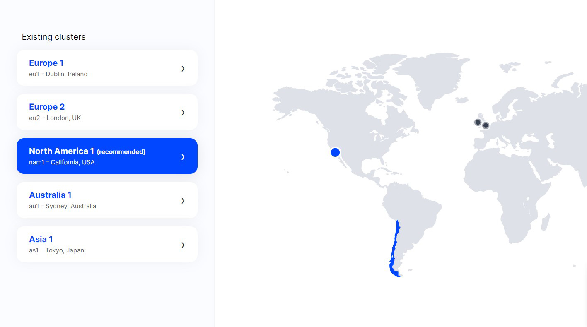
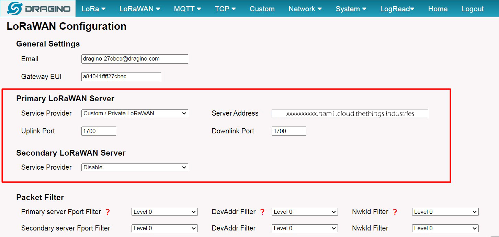

<p align="center"></p>
<h1 align="center"> LoRaWAN </h1> 
<h4 align="right">Ago 24</h4>


<br>

# The Things Stack Cloud (Chile setting)
https://www.thethingsindustries.com/

1. Get a Unique gateway ID ```Gateway EUI```
2. Create an account in TTN 
3. Sign up a user account in TTN server
4. Choose the Cluster: ```nam1``` North America 1	California, USA
5. Get the Network name / Network ID
6. Get the server address ```xxxxxxxxx.nam1.cloud.thethings.industries```
7. Add a gateway in TTN V3 Server using the ```Gateway EUI``` / Gateway server address must match the gateway configuration (la dirección del gateway debe ser igual tanto en el server TTN como el mismo gateway. esta dirección involcra el cluster)
8. Choose frecuency plan ```Australia 915-928 MHz,FSB 2 (used by TTN)```
9. After creating the gateway, you can see the gateway info


## Setting TTN server
https://xxxxxxxxxx.nam1.cloud.thethings.industries/console/

## Screenshot

<p align="center"></p>
<p align="center"></p>
<p align="center"></p>

<br>

# DLOS8N Outdoor LoRaWAN Gateway Setting
<p align="center"></p>

info: http://wiki.dragino.com/xwiki/bin/view/Main/User%20Manual%20for%20All%20Gateway%20models/DLOS8N/

## Typical Network Setup
```Wifi AP:```<br>
name: dragino-27cbec <br>
password: dragino+dragino

```Browser IP``` <br> 
10.130.1.1

```Router Access```<br>
Nombre de usuario: root <br>
Contraseña: dragino

## Ethernet conection

```Eth0 PC setting``` <br>
IP: 172.31.255.253 <br>
Netmask: 255.255.255.252

```Browser IP``` <br>
172.31.255.254:8000

```Router Access```<br>
Nombre de usuario: root <br>
Contraseña: dragino

info: http://wiki.dragino.com/xwiki/bin/view/Main/User%20Manual%20for%20All%20Gateway%20models/DLOS8N/#H11.3IconfiguredDLOS8NforWiFiaccessandlostitsIP.Whattodonow3F

## DLOS8N Setting 
frecuencia: 915/920/923/ EC25-aux

## Access the Internet as a WiFi Client
```path: Network/Wifi/WiFi WAN Client Settings``` <br>
Habilitar (Enable WiFi WAN Client) <br>
Usar (WiFi Survey) para elegir Red WiFi <br>
Usar (Passphrase) para colocar password red

<p align="center"></p>
<br>

## 4G setting
????????????????????????????

## Frequency LoRa Chile

```path: LoRa/Radio Settings``` <br>
keep Alive Period (sec): 120 <br>
Frequency Plan: AU915 Australia 915Mhz (915-928) <br>
Frecuency Sub Band: 2:AU915,FSB2 (916.8-918.2)

<p align="center"></p>
<br>

## Configure DLOS8N to connect to TTN v3

```path: LoRaWan/LoRaWAN-Semtech UDP/LoRaWAN Configuration/Primary LoRaWAN Server``` <br>
Service Provider: Custom / Private LoRaWAN <br>
Server Address: xxxxxxxxx.nam1.cloud.thethings.industries (este dato se obtiene después de crear el server en el TTN)<br>
Uplink : 1700 <br>
Downlink: 1700

<p align="center"></p>
<br>

Note: The server address must match the Gateway server address you choose in TTN V3.

## if all is ok!

<p align="center"></p>

In TTN v3 portal, we can also see the gateway is connected.

## LED Indicators
* SOLID GREEN: DLOS8N is alive with LoRaWAN server connection.

* BLINKING GREEN:Device has internet connection but no LoRaWAN Connection  or Device is in booting stage, in this stage, it will BLINKING GREEN for several seconds and then RED and YELLOW will blink together.

* SOLID RED: Device doesn't have Internet connection.

<br>

# Add a LoRaWAN End Device to The Things Stack Cloud (TTN)
define the device in TTN v3:
DEV EUI - Unique ID code for a particular device. <br>
APP EUI - ID code for an Application defined in TTN v3.<br>
APP Key - Unique key to secure communications with a particular device.<br>

1. Create application in TTN
2. Add end device
3. Register end device with DEV EUI APP / EUI / APP Key
4. Secondly, choose the corresponding frequency and LoRaWAN ```AU_915_928_FSB_2```

info: http://wiki.dragino.com/xwiki/bin/view/Main/User%20Manual%20for%20All%20Gateway%20models/DLOS8N/


<br>

---
Copyright &copy; 2022 [carjavi](https://github.com/carjavi). <br>
```www.instintodigital.net``` <br>
carjavi@hotmail.com <br>
<p align="center">
    <a href="https://instintodigital.net/" target="_blank"></a>
</p>


# LoRaWAN
LoRaWAN setting/ end point
